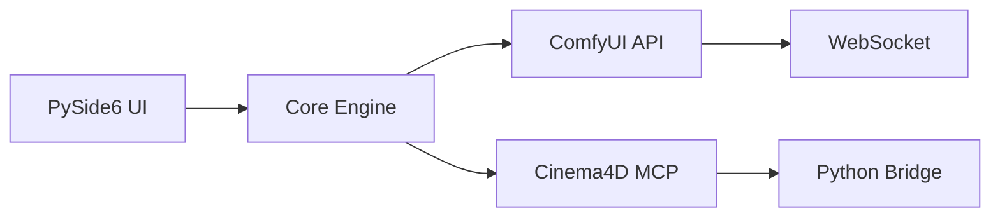

# System Architecture

> [!WARNING]
> This document describes the intended architecture. Many components are incomplete or non-functional.

## Overview

ComfyUI-Cinema4D Bridge aims to connect AI generation capabilities with 3D creation tools.

## Current Architecture

## Component Status

### Frontend Layer  75% Complete
- **PySide6 GUI** - Working
- **Tab System** - Working
- **Dark Theme** - Working
- **3D Viewer** - Partially implemented

### Core Engine   60% Complete
- **Workflow Manager** - Basic functionality
- **State Management** - Working
- **Config System** - Working
- **Task Queue** - Limited functionality

### Integration Layer = Mixed Status
- **ComfyUI Client** - 80% working
- **WebSocket API** - Working
- **Cinema4D MCP** - 40% complete
- **File System** - Working

## Key Issues

1. **Cinema4D Integration** - Most features non-functional
2. **Error Handling** - Many unhandled edge cases
3. **Async Operations** - Incomplete implementation
4. **UI State Sync** - Unreliable

## Development Notes

- Use Claude Code to help navigate the codebase
- Many files appear complete but contain non-functional code
- Focus on fixing core functionality before adding features
- Test with simple workflows first