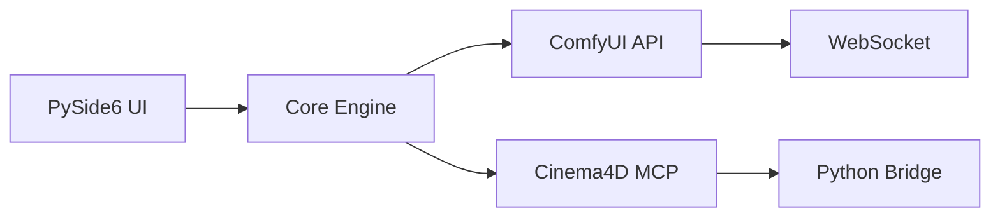

<div align="center">

```
    ▄████▄   ▒█████   ███▄ ▄███▓  █████▒▓██   ██▓ █    ██  ██▓
   ▒██▀ ▀█  ▒██▒  ██▒▓██▒▀█▀ ██▒▓██   ▒  ▒██  ██▒ ██  ▓██▒▓██▒
   ▒▓█    ▄ ▒██░  ██▒▓██    ▓██░▒████ ░   ▒██ ██░▓██  ▒██░▒██▒
   ▒▓▓▄ ▄██▒▒██   ██░▒██    ▒██ ░▓█▒  ░   ░ ▐██▓░▓▓█  ░██░░██░
   ▒ ▓███▀ ░░ ████▓▒░▒██▒   ░██▒░▒█░      ░ ██▒▓░▒▒█████▓ ░██░
   ░ ░▒ ▒  ░░ ▒░▒░▒░ ░ ▒░   ░  ░ ▒ ░       ██▒▒▒ ░▒▓▒ ▒ ▒ ░▓  
   ░  ▒     ░ ▒ ▒░ ░  ░      ░ ░       ▓██ ░▒░ ░░▒░ ░ ░  ▒ ░
                                    ░      ▒ ▒ ░░   ░░░ ░ ░  ▒ ░
    ╔═╗╦╔╗╔╔═╗╔╦╗╔═╗  ╦ ╦╔╦╗     ░        ░ ░        ░      ░  
    ║  ║║║║║╣ ║║║╠═╣  ╚═╦╝ ║║                ░ ░                
    ╚═╝╩╝╚╝╚═╝╩ ╩╩ ╩    ╩══╩╝                                  
```

# **COMFYUI ↔ CINEMA 4D BRIDGE**

[](https://github.com/yamb0x/comfyui-cinema4d-bridge)
[](https://www.python.org/)
[](https://github.com/comfyanonymous/ComfyUI)
[](https://www.maxon.net/)

</div>

---

> [!CAUTION]
> **This project is EXPERIMENTAL and NOT functional.** Most features are incomplete or broken. Do not use in production.

---

## 📽️ **DEMO VIDEO**

<div align="center">

https://github.com/user-attachments/assets/PLACEHOLDER_VIDEO_ID

> **Note:** To embed the video directly on GitHub:
> 1. Go to [create a new issue](https://github.com/yamb0x/comfyui-cinema4d-bridge/issues/new)
> 2. Drag `mp4/comft2c4d tool.mp4` into the comment box
> 3. Copy the generated URL and replace PLACEHOLDER_VIDEO_ID above
> 4. Cancel the issue (don't submit)
> 
> **Alternative:** [▶️ Watch on Vimeo](https://vimeo.com/1100563312) | [📥 Download MP4](https://github.com/yamb0x/comfyui-cinema4d-bridge/raw/main/mp4/comft2c4d%20tool.mp4)

</div>

---

## 🎯 **PROJECT VISION**

Seamlessly bridge **ComfyUI's AI generation capabilities** with **Cinema 4D's professional 3D tools** through an intuitive desktop application.

---

## 🏗️ **SYSTEM ARCHITECTURE**



---

## ⚡ **FEATURE STATUS**

### ✅ **Currently Working (Limited)**
- **Basic UI Framework** - PySide6 application with tabs
- **ComfyUI Connection** - WebSocket integration (80% complete)
- **Workflow Loading** - JSON workflow execution
- **Configuration System** - Settings and state management
- **MCP Servers** - Basic Model Context Protocol setup

### 🔄 **In Active Development**
- **3D Model Generation** - Hunyuan2 mesh creation pipeline
- **Texture Generation** - JuggernautXL PBR texturing
- **Cinema4D Bridge** - Direct scene import (40% complete)
- **NLP Commands** - Natural language scene control
- **3D Preview** - Three.js viewer integration

### 📅 **Planned Features**
- **MoGraph Integration** - AI-driven motion graphics
- **Audio Reactive** - Sound-to-animation pipeline
- **Batch Processing** - Queue multiple generations
- **Cloud Rendering** - Distributed processing
- **Plugin System** - Extensible architecture

---

## 🛠️ **TECHNICAL STACK**

<div align="center">

| Component | Technology | Status |
|:---------:|:----------:|:------:|
| **Frontend** | PySide6 + Custom Dark Theme | ✅ 75% |
| **Backend** | Python 3.9+ Async | ✅ 60% |
| **AI Engine** | ComfyUI WebSocket API | ✅ 80% |
| **3D Bridge** | Cinema4D Python + MCP | 🔄 40% |
| **Workflows** | JSON Pipeline System | ✅ Ready |
| **Storage** | Local File + Config | ✅ Ready |

</div>

---

## 📊 **DEVELOPMENT PROGRESS**

```
Core Systems      ▓▓▓▓▓▓▓▓▓▓▓▓░░░░░░░░  60%
UI/UX Design      ▓▓▓▓▓▓▓▓▓▓▓▓▓▓▓░░░░░  75%
ComfyUI Bridge    ▓▓▓▓▓▓▓▓▓▓▓▓▓▓▓▓░░░░  80%
C4D Integration   ▓▓▓▓▓▓▓▓░░░░░░░░░░░░  40%
Documentation     ▓▓▓▓▓▓░░░░░░░░░░░░░░  30%
Testing Suite     ▓▓▓▓░░░░░░░░░░░░░░░░  20%
```

---

## 🚀 **QUICK START** *(When Ready)*

```bash
# ⚠️ NOT RECOMMENDED - PROJECT IS NOT FUNCTIONAL YET

# Future installation:
git clone https://github.com/yamb0x/comfyui-cinema4d-bridge.git
cd comfyui-cinema4d-bridge
pip install -r requirements.txt
python main.py
```

---

## 📁 **PROJECT STRUCTURE**

```
comfy-to-c4d/
├── src/
│   ├── core/          # Main application logic
│   ├── ui/            # PySide6 interface components
│   ├── mcp/           # Model Context Protocol clients
│   └── c4d/           # Cinema4D integration modules
├── workflows/         # ComfyUI workflow definitions
├── mcp_servers/       # MCP server implementations
├── config/           # Configuration files
└── mp4/              # Demo videos
```

---

## 🤝 **CONTRIBUTING**

<div align="center">

```
╔════════════════════════════════════════════╗
║     🚫 NOT ACCEPTING CONTRIBUTIONS YET     ║
║                                            ║
║  The codebase is changing rapidly.         ║
║  Watch this repo for beta announcements.   ║
╚════════════════════════════════════════════╝
```

</div>

---

<div align="center">

**Built with ambition by the AI × 3D Community**

[⬆ Back to Top](#comfyui--cinema-4d-bridge)

</div>