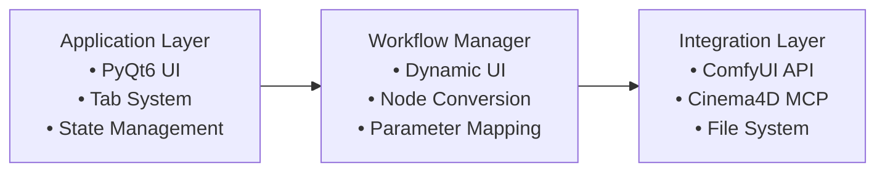

# ComfyUI to Cinema4D Bridge

> **Connecting AI generation workflows with Cinema4D 3D world building**

[](https://www.python.org/downloads/)
[](https://opensource.org/licenses/MIT)
[](https://github.com/comfyanonymous/ComfyUI)
[](https://www.maxon.net/)

---

## Overview

This application addresses the workflow gap between AI generation tools and professional 3D software. Rather than manual file transfers and texture linking, it provides a unified interface that maintains creative momentum across image generation, 3D modeling, texture creation, and AI tools.

The system dynamically adapts to any ComfyUI workflow through runtime analysis and automatic UI generation, ensuring compatibility without dependencies on custom nodes or specific configurations.

## System Architecture


```mermaid
graph LR
    A[Application Layer<br/>• PyQt6 UI<br/>• Tab System<br/>• State Management] --> B[Workflow Manager<br/>• Dynamic UI<br/>• Node Conversion<br/>• Parameter Mapping]
    B --> C[Integration Layer<br/>• ComfyUI API<br/>• Cinema4D MCP<br/>• File System]
```

## Current Status

| Component | Status | Notes |
|-----------|--------|-------|
| **Image Generation** | ✅ Complete | Universal workflow support |
| **3D Model Creation** | ✅ Complete | Hunyuan 3D with live preview |
| **Texture Generation** | 🔄 Working | PBR pipeline implementation |
| **Cinema4D Bridge** | 🔄 80% | MCP integration active |
| **Dynamic UI System** | ✅ Complete | Runtime workflow adaptation |

## ✨ Features

### 🎨 Image Generation
- **Universal ComfyUI workflow compatibility** - Works with any workflow
- **Dynamic UI generation** - Automatic interface adaptation
- **Custom node conversion** - Seamless compatibility layer
- **Cross-tab persistence** - Selection syncing across tabs

### 🗿 3D Model Creation  
- **Hunyuan3D 2.0/Tripo3D integration** - Latest 3D generation models
- **Real-time Three.js viewers** - Interactive 3D preview
- **Automatic workflow adaptation** - No manual configuration needed
- **Cross-tab selection** - Seamless model handoff

### 🎭 Texture Generation
- **PBR material pipeline** - Physically based rendering support
- **Three.js material preview** - Real-time texture visualization
- **Procedural synthesis** - Prompt-driven texture creation
- **Cinema4D integration** - Direct material export

### 🎬 Cinema4D Integration
- **Model Context Protocol** - Seamless communication layer
- **NLP Dictionary** - Natural language command mapping
- **Direct model import** - Generated assets to Cinema4D scenes

## 🗺️ Development Roadmap

### 🎯 Priority 1: Texture Generation
- [ ] **Debug workflow issues** - Resolve current texture generation problems
- [ ] **Batch processing** - Support multiple model texturing
- [ ] **Pipeline optimization** - Improve PBR workflow reliability

### 🎯 Priority 2: Cinema4D Integration
- [ ] **Test NLP Dictionary** - Validate existing command mappings (80% complete)
- [ ] **Claude Code SDK Integration** - [Replace NLP system](https://docs.anthropic.com/en/docs/claude-code/sdk)
  - Leverage AI for complex scene generation
  - Utilize existing NLP dictionary as command reference
  - Enable natural language to Cinema4D scene creation

### 🎯 Priority 3: Settings & Optimization
- [ ] **Consistent UI** - Unified settings across all tabs
- [ ] **Performance optimization** - Reduce debug overhead and improve speed
- [ ] **Magic prompt enhancement** - Improve configuration interface

### 🎯 Priority 4: Enhanced 3D Views
- [ ] **Untextured model support** - Better visualization for raw geometry
- [ ] **Multiple viewing modes** - Enhanced 3D inspection capabilities


## 🚀 Quick Start

### Prerequisites
- **Python 3.12+** 
- **ComfyUI** running on `localhost:8188`
- **Cinema4D R2024+** (optional for full integration)
- **8GB+ RAM** recommended
- **CUDA GPU** for optimal performance

### Installation

```bash
# Clone the repository
git clone https://github.com/yamb0x/comfyui-cinema4d-bridge.git
cd comfyui-cinema4d-bridge

# Create virtual environment
python -m venv venv

# Activate environment
source venv/bin/activate  # Linux/Mac
# or
venv\Scripts\activate     # Windows

# Install dependencies
pip install -r requirements.txt

# Launch application
python main.py
```

### Configuration
Copy `.env.example` to `.env` and configure paths as needed. The application will auto-detect ComfyUI on first run.

## 📖 Documentation

| Document | Purpose |
|----------|---------|
| **[QUICKSTART.md](QUICKSTART.md)** | Detailed setup guide |
| **[ARCHITECTURE.md](ARCHITECTURE.md)** | Technical implementation |
| **[docs/ROADMAP.md](docs/ROADMAP.md)** | Development roadmap |
| **[CLAUDE.md](CLAUDE.md)** | Development patterns |
| **[docs/](docs/)** | Complete documentation index |

## 🔧 Technical Stack

| Component | Technology | Purpose |
|-----------|------------|---------|
| **Frontend** | PyQt6 | Asynchronous UI with smart caching |
| **Backend** | Python + asyncio | Event loop management |
| **3D Rendering** | Three.js | Real-time model preview |
| **AI Integration** | ComfyUI API | Automatic node conversion |
| **Cinema4D** | Python API + MCP | Professional 3D integration |

### Key Innovations
- **Runtime workflow analysis** and automatic UI generation
- **Custom node conversion** to standard ComfyUI equivalents  
- **Cross-application state** synchronization
- **Memory-efficient** asset management with lazy loading

## 📋 System Requirements

| Requirement | Minimum | Recommended |
|-------------|---------|-------------|
| **Python** | 3.12+ | 3.12+ |
| **RAM** | 8GB | 16GB+ |
| **GPU** | Any | CUDA-compatible |
| **Storage** | 5GB | 20GB+ (for models) |

---

<div align="center">

**Bridging AI generation with professional 3D workflows**

*This project is not affiliated with ComfyUI or Maxon*

[🐛 Report Bug](https://github.com/yamb0x/comfyui-cinema4d-bridge/issues) • [✨ Request Feature](https://github.com/yamb0x/comfyui-cinema4d-bridge/issues) • [📖 Documentation](docs/)

</div>